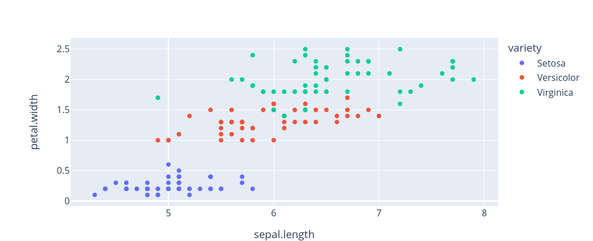

# Preparing

- Install **torch**
- Copy the Iris data over

# Gradient descent

- The first issue we identified with Newton-type methods is that they need you to approximate the Hessian of the function
- This is intrinsically expensive and gets much worse when there are many parameters
- However consider that, when we actually work out what Newton's method tells us to do (for simplicity assume $d=1$) we obtain an update of

$$
\theta - \frac{f^\prime(\theta)}{f^{\prime\prime}(\theta)}
$$

- The fact that we need to subtract an amount proportional to the first derivative has an intuitive explanation: "downhill" is where the minimum must obviously be
- So if we don't want to calculate the Hessian, why not just do something like this (in higher dimensions), for some fixed small constant $\alpha$?

$$
\theta - \alpha f^{\prime}(\theta)
$$

- You can probably already tell me why not, which is that we might overshoot, and we also might go way too slow
- These things are true, but nevertheless we use an approach like this all the time, and it is called **gradient descent**
- The small constant is called the **learning rate**
- It is slow, yes, but not as slow as if we had to calculate the full matrix of partial derivatives

# Automatic differentiation

- The problem of numerical differentiation being inaccurate and slow is a more recalcitrant one, but has a more refreshing solution: rather than having an inefficient, ugly solution (like gradient descent), it has an elegant, highly effective solution: **automatic differentiation**
- The insight is as follows: **how can it possibly be that I had to take several whole courses on calculus and my computer can't be bothered to look up the derivatives of things?**
- Indeed, pretty much all of the models we use just re-use the same old functions (e.g., logistic, residual squared error) over and over again
- We will see our models getting complicated, but so far our models are pretty darn simple; nevertheless, all that will ever happen is that the loss function is going to get more complex
- In particular, the model, and therefore the loss function, is just a complicated function **composed out of a number of smaller functions**
- The **chain rule** can therefore come to the rescue

$$
\begin{array}{rrcl}
& h(x) & = & f(g(x)) \\
\Rightarrow & \frac{d}{dx}h(x) & = & \frac{d}{dx}f(g(x))\cdot \frac{d}{dx}g(x)
\end{array}
$$

- In the more general case, when a function takes multiple inputs (e.g., $ h(x, y) =  f(l(x), m(x), n(y))$, it only makes sense to talk about the derivative **with respect to** one input variable at a time
- The partial derivative with respect to a given variable (e.g., $x$) is taken by applying the rule above for each of the arguments and **summing the results** (writing this out in notation is more confusing than just saying it)
- Hence there is a better idea called **automatic differentiation**: as I build my model, I make a list of what all the functions are that I'm using; then, when I go to train it, I just look up what the derivatives of those functions are and I use those
- The usual approach is to work backwards from the outermost function (**reverse-mode AD** or **back-propagation**), e.g., for $x\cdot (x+y) + y\cdot y$ (see tree on board)

# Pytorch

- To anticipate what is coming in the next lecture, **gradient descent using back-propagation** is the standard way of training complicated models we call neural networks
- Now, once upon a time automatic differentiation was not automatic
- That is, to use this approach in practice, people sat around doing something like what I just did on the board and then programmed the formula for the gradient on their own
- It is often said that what led to the explosion of neural network models in the last ten years was the discovery of efficient methods for doing linear operations on specialized hardware called GPUs
- Perhaps, but the gas on the fire was when it was finally decided that a library for optimizing complicated models with backprop could also just keep track of all the derivatives for you
- This library was called **Torch** and, after some rather explosive internal politics at Facebook AI, a version that worked with Python was developed called **Pytorch**
- Before moving on to anything as complicated as a neural network, let's have a look at Pytorch for fitting a simple logistic regression model

# Using Pytorch the hard way

- The following is best done in a script
- First let's look at some new data, and, to make our lives simple, let's just consider a two-class classification in this (three-class) data, that between **virginica** and **non-virginica**
- Read in the Iris data as an object called *iris*



- The above only shows two of the four dimensions, of course; let's use all of them, **sepal.length**, **sepal.width**, **petal.length**, **petal.width**
- You should also now explicitly import Numpy, which, although you didn't install it explicitly, is a dependency of several of the packages you installed already
- Let's also do a random 90/10 train/test split
- Before doing anything random, set the random seed using *numpy.random.seed()*
- Here is an easy way to take a sample that maintains the initial balance:

```
train = iris.groupby('variety', group_keys=False).apply(lambda x: x.sample(int(0.9*len(x))), include_groups=True)
test = iris.loc[iris.index.difference(train.index.values),:]
```


- Let's also turn our data frame into a Numpy array (we will need this to work with PyTorch), and keep the predictor variables in a separate array than the class variable
- You can convert a Pandas dataframe into a Numpy array by accessing the field *.values*
- The class variable should just be a vector
- Now set up Pytorch as follows

```
dtype = torch.float
torch.set_default_device("cpu")
```

- We won't be working on the GPU, and indeed, everything we will be doing today is so low-intensity that we probably wouldn't even really need to move off the login node (but let's do so anyway)
- The key to Torch is a special class called *tensor* - you will see shortly why it's not just called "matrix" - which, importantly, serves to keep track of partial derivatives
- The data will be put into tensors:

```
X_train_t = torch.tensor(X_train, dtype=dtype)
y_train_t = torch.tensor(y_train, dtype=dtype)
```

- As will the parameters; here we are going to do a logistic regression with five parameters, a bias term $\beta_0$ plus four coefficients
- In the next step I will be doing things the "hard way", creating scalar tensors, one for each parameter, which should help to concretize what is going on
- The first argument to *torch.randn* is the dimension of the array we want, but if we want a scalar, we can pass an empty tuple
```
b0 = torch.randn((), dtype=dtype, requires_grad=True)
b1 = torch.randn((), dtype=dtype, requires_grad=True)
b2 = torch.randn((), dtype=dtype, requires_grad=True)
b3 = torch.randn((), dtype=dtype, requires_grad=True)
b4 = torch.randn((), dtype=dtype, requires_grad=True)
```

- Notice that, only for these arguments, I have set *requires_grad=True*; that means that the gradient will not be calculated with respect to the other tensors
- Now, for some number of epochs (i.e., passes through the whole training set - let's say 5000 or so), you want to (1) calculate the $z$ values and the loss
- This will get you a set of tensors *that contain the whole computation graph*; the loss value will be in a tensor too
- On that object - let's say it's called *loss* - do

```
loss.backward(retain_graph=True)
```

- This will calculate the partial derivatives
- Finally, do the following to carry out the gradient descent

```
with torch.no_grad():
    b0 -= learning_rate*b0.grad
    ...
    b0.grad = None
    ...
```

- It would also be useful to print out the loss every (let's say) 100 epochs
- **Implement this**

# Making your life easier

- Perhaps (?) obviously, you can make vectors and do matrix multiplication with Pytorch, saving you the annoying work I did above
- Furthermore, you can even combine the two in one fell swoop by using a class called *torch.nn.Linear*, which creates a (or many - see next session) vector, and has a simple *forward()* method that does exactly what you would think, takes the dot product of its input with the vector

```
linmod = torch.nn.Linear(4, 1)
```

- We can also explicitly apply the logistic function by then taking the output of a *torch.nn.Linear* and then passing it into a *torch.nn.Sigmoid*
- However, for numerical stability (and not only for the reasons outlined in the previous handout) it is better not to explicitly calculate the probabilities
- So Torch also has a way to calculate an equivalent loss directly on the $z$ values, as we did previously
- The function is *torch.nn.BCEWithLogitsLoss()*
- BCE stands for "binary cross entropy", another name for the log likelihood for binary classification that we have been using
- We can also dispense with the work of updating the gradient ourselves using an *optimizer* object
- The great thing about this is that there are different types of algorithms, some of which are more efficient than regular gradient descent
- To use a somewhat more efficient algorithm called Adam, you can create an object of class *torch.optim.Adam*; when constructing the object, the first argument should be the parameters of your model, which in our case can be accessed as *linmod.parameters()*; the *lr* argument sets the learning rate
- Now, you can access the "gradient descent" and "zero the gradient" steps using

```
optimizer.step()
optimizer.zero_grad()
```